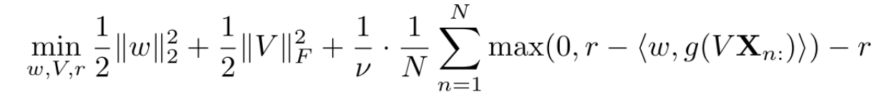

### Final Report *delete this line after review*
<h1 style="text-align: center;">Can you write a winning essay?</h1>
         <h4 style="text-align: center;">CCMBrokers</h4>
 
Aley Abdel-Ghaffar, Shevaughn Holness, Yu Zhu, Zeynep Kilinc, Hannah Snell

 
<h2 align="center">Introduction</h2>

Many of us graduate students spend countless hours preparing application materials for well-known fellowships in order to receive the necessary funding to complete our research. The National Science Foundation’s Graduate Student Research Fellowship is arguably the most well-known graduate fellowship available to citizens of the United States, but as a result, it is a highly competitive fellowship to receive. Many fellowships such as NSF GRFP are also known for being extremely hard to predict, so many applications, even if appearing qualified by many standards on paper. We are seeking to better understand the features of a winning NSF GRFP essay and how applicable these features are to other similar graduate research fellowship applications. The fact that none of us can escape the issue of funding in graduate school (even at Brown) have initially motivated us to detect the features of a winning NSF GRFP essay. The accessibility of NSF GRFP winning essays on the internet have transformed this ambition to our class project.

<h2 style="text-align: center;">Methodology</h2>

<h3 style="text-align: left ;">1. Preprocessing</h3>

The PDF files have been downloaded automatically through their hyperlinks using the requests package. Since some of the file links for these PDFs were submitted back in 2006, their accession links have expired. Therefore, we proceed with 231 samples (see challenges). Each PDF is converted into a string variable. These strings are stored in the main corpus dataframe in the ‘text’ column, and each essay string is matched with its success outcome as ‘Winner’ or ‘Honorable Mention’. Then, the strings are stripped of their punctuation. The lowest occurring words are detected, using all essay strings as the input. Once these words are detected and stored in a dictionary, they are masked from each essay's individual string. The success outcomes of the essays are converted into binary format to be passed to the model. The outcomes and the essay texts are passed to the model as two individual lists with corresponding indexes.

<h3 style="text-align: left ;">2. Clustering Autoencoder </h3>

Our first model was built with the goal of assessing how well winners and honorable mentions cluster when trained unsupervised. Preprocessed data were tokenized using the Keras Tokenizer function. Sequences were padded so that all essays were the same length. Train and test data were split based on an 80/20 ratio and checked so that there were both classes of essays (wins and honorable mentions) present in both the training and testing sets. 
A baseline comparison model using only KMeans clustering was run on the testing data using scikit-learn’s KMeans function. A confusion matrix and accuracy score (using scikit-learn accuracy_score function) were generated from this model’s results. 
A fully-connected autoencoder was constructed using three dense layers in the encoder and the same three dense layers in the decoder followed by an MSE loss function. The total loss after 1500 epochs was 74.4391. The encoder weights were then saved for later input into the clustering model. 
The clustering autoencoder was implemented by building a custom clustering layer to provide soft labels to the training data. The student T-distribution was used to construct a q matrix that represents the probabilities of assigning a sample to an indicated cluster. The weights used to construct this matrix are inputted as the saved weights from the pretrained encoder. The clustering model was then compiled with an Adam optimizer (LR = 0.0001) and a corresponding KL-divergence loss metric. The clustering model was then trained for 8000 epochs and reached an accuracy of 52% with a corresponding KL-divergence loss of 0.0. Finally, the clustering model was run on the testing data to produce an accuracy score of 49% and a corresponding KL-divergence loss of 0.0. A confusion matrix was constructed to compare the performance of classification from the clustering autoencoder to the original baseline KMeans clustering run. 

<h3 style="text-align: left ;">3. Outlier detection model </h3>
<h4 style="text-align: left ;">3.1 Semi-Supervised Variational autoencoder </h4>

The outlier detection models have an assumption that only a small proportion of the real world data are labeled and they belong to one class while the remaining unlabeled data can be either the same class or an outlier that behaves significantly differently. Therefore, in addition to the training and testing dataset split, we added another mask to the training dataset, which labeled a certain amount of Winner samples, assigned them as “labeled,” and let the remaining part to be “unlabeled.” Then data was preprocessed by loading in all the essays and storing them in a list. Each word was then tokenized. Thus the input was a list of essays where each word in the essay was tokenized and then put through an embedding layer. 

We then trained a variational autoencoder with a standard loss composed by a reconstruction loss plus a KL divergences loss for both labeled and unlabeled samples in the dataset. Moreover, the model has one additional KL divergence term, which forces the latent distribution of the labeled samples only (which are all Winner cases) to be close to the scaled unit Gaussian distribution. The model was trained for 10 epochs with an Adam optimizer and we got a latent representation from the freezed encoder. The training loss is 0.001182. 

<h4 style="text-align: left ;">3.2 One class classification feed forward neural network </h4>

The next important part of the outlier detection process is the one class classification neural network which is trained on the latent representation of the essays obtained from variational autoencoder and outputs a decision score for each input in the test set. The decision score is what indicates if an input is an outlier or not: values closer to 0 are likely to be outliers whereas values further away from 0 are unlikely to be outliers. The model is trained on the following objective

where w is the final output, V is the output from the first FC layer, g is the sigmoid activation function, r is a bias term, and Xn is the latent representation we got from the previous encoder.

<h3 style="text-align: left ;">4. CARP  </h3>

The input for the CARP is a two column where the first column is the proposals and the second column is its label. We only successfully train the zero-shot version, while the few-show case requires both GPUs and openai API, which we have limited access to. However, because no examples of clues and reasonings are provided, the model is not trained well to have significant outputs.  

 
<h2 style="text-align: center;">Results</h2>

<h3 style="text-align: left ;"> 1. Clustering Autoencoder  </h3>

Clustering Autoencoder 
To evaluate the performance of the clustering autoencoder, we ran a baseline model of regular KMeans clustering with the same testing data. The confusion matrices below show the results of the KMeans clustering (left) and the Autoencoder + KMeans clustering model. 

: Confusion matrix representation of the performance of KMeans clustering on the test data. The KMeans clustering performed at a total accuracy of 12%. 
Figure 1b (right): Confusion matrix representation of the performance of the clustering autoencoder on the test data. The clustering autoencoder performed at a total accuracy of 49%.")
