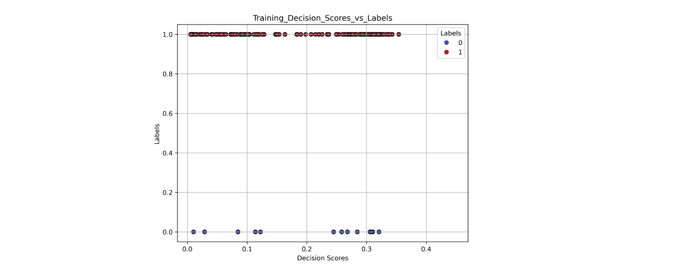
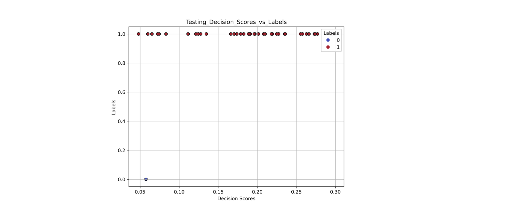

### Final Report *delete this line after review*
<h1 align="center">Can you write a winning essay?</h1>
<h4 align="center">CCMBrokers</h4>
 
Aley Abdel-Ghaffar, Shevaughn Holness, Yu Zhu, Zeynep Kilinc, Hannah Snell

 
<h2 align="center">Introduction</h2>

Many of us graduate students spend countless hours preparing application materials for well-known fellowships in order to receive the necessary funding to complete our research. The National Science Foundation’s Graduate Student Research Fellowship is arguably the most well-known graduate fellowship available to citizens of the United States, but as a result, it is a highly competitive fellowship to receive. Many fellowships such as NSF GRFP are also known for being extremely hard to predict, so many applications, even if appearing qualified by many standards on paper. We are seeking to better understand the features of a winning NSF GRFP essay and how applicable these features are to other similar graduate research fellowship applications. The fact that none of us can escape the issue of funding in graduate school (even at Brown) have initially motivated us to detect the features of a winning NSF GRFP essay. The accessibility of NSF GRFP winning essays on the internet have transformed this ambition to our class project.

<h2 align="center">Methodology</h2>

<h3 align="left">1. Preprocessing</h3>

The PDF files have been downloaded automatically through their hyperlinks using the requests package. Since some of the file links for these PDFs were submitted back in 2006, their accession links have expired. Therefore, we proceed with 231 samples (see challenges). Each PDF is converted into a string variable. These strings are stored in the main corpus dataframe in the ‘text’ column, and each essay string is matched with its success outcome as ‘Winner’ or ‘Honorable Mention’. Then, the strings are stripped of their punctuation. The lowest occurring words are detected, using all essay strings as the input. Once these words are detected and stored in a dictionary, they are masked from each essay's individual string. The success outcomes of the essays are converted into binary format to be passed to the model. The outcomes and the essay texts are passed to the model as two individual lists with corresponding indexes.

<h3 align="left">2. Clustering Autoencoder </h3>

Our first model was built with the goal of assessing how well winners and honorable mentions cluster when trained unsupervised. Preprocessed data were tokenized using the Keras Tokenizer function. Sequences were padded so that all essays were the same length. Train and test data were split based on an 80/20 ratio and checked so that there were both classes of essays (wins and honorable mentions) present in both the training and testing sets. 
A baseline comparison model using only KMeans clustering was run on the testing data using scikit-learn’s KMeans function. A confusion matrix and accuracy score (using scikit-learn accuracy_score function) were generated from this model’s results. 
A fully-connected autoencoder was constructed using three dense layers in the encoder and the same three dense layers in the decoder followed by an MSE loss function. The total loss after 1500 epochs was 74.4391. The encoder weights were then saved for later input into the clustering model. 
The clustering autoencoder was implemented by building a custom clustering layer to provide soft labels to the training data. The student T-distribution was used to construct a q matrix that represents the probabilities of assigning a sample to an indicated cluster. The weights used to construct this matrix are inputted as the saved weights from the pretrained encoder. The clustering model was then compiled with an Adam optimizer (LR = 0.0001) and a corresponding KL-divergence loss metric. The clustering model was then trained for 8000 epochs and reached an accuracy of 52% with a corresponding KL-divergence loss of 0.0. Finally, the clustering model was run on the testing data to produce an accuracy score of 49% and a corresponding KL-divergence loss of 0.0. A confusion matrix was constructed to compare the performance of classification from the clustering autoencoder to the original baseline KMeans clustering run. 

<h3 align="left">3. Outlier detection model </h3>
<h4 align="left">3.1 Semi-Supervised Variational autoencoder </h4>

The outlier detection models have an assumption that only a small proportion of the real world data are labeled and they belong to one class while the remaining unlabeled data can be either the same class or an outlier that behaves significantly differently. Therefore, in addition to the training and testing dataset split, we added another mask to the training dataset, which labeled a certain amount of Winner samples, assigned them as “labeled,” and let the remaining part to be “unlabeled.” Then data was preprocessed by loading in all the essays and storing them in a list. Each word was then tokenized. Thus the input was a list of essays where each word in the essay was tokenized and then put through an embedding layer. 

We then trained a variational autoencoder with a standard loss composed by a reconstruction loss plus a KL divergences loss for both labeled and unlabeled samples in the dataset. Moreover, the model has one additional KL divergence term, which forces the latent distribution of the labeled samples only (which are all Winner cases) to be close to the scaled unit Gaussian distribution. The model was trained for 10 epochs with an Adam optimizer and we got a latent representation from the freezed encoder. The training loss is 0.001182. 

<h4 align="left">3.2 One class classification feed forward neural network </h4>

The next important part of the outlier detection process is the one class classification neural network which is trained on the latent representation of the essays obtained from variational autoencoder and outputs a decision score for each input in the test set. The decision score is what indicates if an input is an outlier or not: values closer to 0 are likely to be outliers whereas values further away from 0 are unlikely to be outliers. The model is trained on the following objective

where w is the final output, V is the output from the first FC layer, g is the sigmoid activation function, r is a bias term, and Xn is the latent representation we got from the previous encoder.

<h3 align="left">4. CARP  </h3>

The input for the CARP is a two column where the first column is the proposals and the second column is its label. We only successfully train the zero-shot version, while the few-show case requires both GPUs and openai API, which we have limited access to. However, because no examples of clues and reasonings are provided, the model is not trained well to have significant outputs.  

 
<h2 align="center">Results</h2>

<h3 align="left"> 1. Clustering Autoencoder  </h3>

Clustering Autoencoder 
To evaluate the performance of the clustering autoencoder, we ran a baseline model of regular KMeans clustering with the same testing data. The confusion matrices below show the results of the KMeans clustering (left) and the Autoencoder + KMeans clustering model. 

: Confusion matrix representation of the performance of KMeans clustering on the test data. The KMeans clustering performed at a total accuracy of 12%. 
Figure 1b (right): Confusion matrix representation of the performance of the clustering autoencoder on the test data. The clustering autoencoder performed at a total accuracy of 49%.")

Figure 1a (left): Confusion matrix representation of the performance of KMeans clustering on the test data. The KMeans clustering performed at a total accuracy of 12%. 
Figure 1b (right): Confusion matrix representation of the performance of the clustering autoencoder on the test data. The clustering autoencoder performed at a total accuracy of 49%.

|   | KMeans   |  Autoencoder + KMeans   |
| ------------- |:-------------:|:-------------:|
| Precision (0 as TP) | 100% | 100% |
| Recall (0 as TP)   | 10%   | 16% |
| Precision (1 as TP)  | 2.7%  | 43% |
|Recall (1 as TP) |  100% | 16% |

Table 1: Precision and Recall of each clustering model on the testing data. 

Table 1 outlines the calculated precision and recall for the two clustering models given which label is the true positive. The KMeans clustering classifies all of the honorable mentions (labeled 0) correctly, but does a poor job of classifying the winning essays, where only one winner is classified correctly. The Autoencoder + KMeans model improves upon the clustering, where all four honorable mentions are still classified correctly and 16 of the 37 winning essays in the training are now categorized correctly. Overall, we see an improvement in the classification of the test essays when using the clustering autoencoder versus just KMeans clustering. 

<h3 align="left"> 2.1 Outlier Detection (Part One)  </h3>

The first step in the outlier detection model is a semi-supervised Variational Autoencoder which creates a latent representation of the essays. This latent representation from the trained VAE was fed into an unsupervised clustering algorithm (OPTICS: Ordering points to identify the clustering structure) which created clusters based on those latent representations. The formed clusters were then used to create a t-SNE plot shown below in Figure 2. 

 Figure 2: t-SNE of latent representation learned from VAE. The x and y axis represent the dimensions. The color of each point corresponds to the numbered cluster they were assigned to, and the shape represents if the associated essay was a winner of the NSF-GRFP (circle) or an Honorable Mention (Diamond). 

<h3 align="left"> 2.2 Outlier Detection (Part Two)  </h3>

After training both parts of the outlier detection model, visualizations of the outlier detection model (focusing on the key factor of decision scores as they decide what are outliers) were created to qualitatively judge the accuracy of our models. 

Figure 3: Essay decisions scores output by the one class classification neural network versus their label (Winner vs Honorable Mention) for training data. The x-axis represents the decision score, and the y-axis represents the label: 0 for Honorable Mention and 1 for Winner. Color is also mapped to the label: red is Winner and blue is Honorable mention. 

Figure 3 shows that both types of the data are still blended together going visually by the decision scores. Thus, at the training stage, we are not fully seeing what we expect.

Figure 4: Essay decisions scores output by the one class classification neural network versus their label (Winner vs Honorable Mention) for the testing data. The x-axis represents the decision score, and the y-axis represents the label: 0 for Honorable Mention and 1 for Winner. Color is also mapped to the label: red is Winner and blue is Honorable mention.

Figure 4 shows our testing data for the outlier detection process and shows us a more accurate representation of what we would expect: the honorable mention is closer to 0 than almost all the other essays (winners). Due to randomly splitting the data, we only have that one point as a visual but in the future it would be nice to re-test with a different dataset. 

While the figures above are the illustrations from 1 round, we also calculated the average AUC score, which is the Area Under the ROC (Receiver Operating Characteristics) Curve, and it tells the capability for the model to distinguish between classes and the higher the score the better. The average AUC score for the training dataset over 10 rounds is 0.4784±0.079 and that for the testing dataset is 0.515±0.224. The highest AUC score for the testing dataset is 0.95 and the lowest score is 0.15. It indicates that our model can perform well on this outlier detection problem, but the performance is not guaranteed. 

<h2 align="center">Challanges</h2>

The intended data to be retrieved originally comprised 288 entries. However, some of the links corresponding to these files are found to be expired. Although there was nothing we could do with the expired links, we were able to retrieve the documents that had a corrupted link.  We have addressed this issue through hyperlink manipulation by passing the document Google ID for Google Drive documents, to the default Google export URL, and by sending direct hyperlink requests along with headers  to various search engines. Additionally, we had to catch other various forms of data storage (as not all are stored on Alex Lang’s site) which each had their own unique fixes. Luckily, we were able to consolidate all fixes into about two functions.

Optimizing the evaluation metric was expected to be a challenge for this project. In the real world scenario, we expected to predict the success of the proposals without a ground truth label, so rather than a classification problem, we treat it as a clustering problem first. While our Clustering Autoencoder model clusters proposals to two different classes, we use a confusion matrix in addition to the accuracy to illustrate the recall and precision rate. Moreover, for our outlier model, as long as it outputs the decision score for each sample, which is similar to a probability distribution saying whether the sample is in the class, we can use AUC score as a metric, while it requires the true label and a target score.

In general, our biggest challenge was working with an incredibly small dataset. Although the final results from our models were better than we expected, we still realize that the interpretability and generalizability of these models to other fellowship applicant pools is probably not great. The most glaring data issue is the fact that we have no true negative data, which represents the “rejected” group of applicants, which could have been useful in this model to parse out features in winning essays that could be advertised as strategies for writing an NSF GRFP research proposal. 

One large challenge for the VAE portion of the outlier detection model was understanding the specialized loss that went with it as we had not looked at a supervised VAE done that way in class. Understanding the math and debating about changing the loss entirely was definitely a long and tough decision. Luckily, we were able to figure out the loss. Furthermore, for part two, finding a non-qualitative metric (as the current metric is visually looking at the decision scores and their associated labels) was difficult, and we did not end up finding a better alternative.

Finally, another challenge is to run the CARP. As long as the CARP is a gpt3-based model, it requires the openai API. We got a personal API key to run the model, however, it has a maximum token limitation. Because our texts are long, we failed to train the model with the full dataset, but a subset of 40 proposals, which led to unsatisfactory results. Moreover, the first step for the few-shot model is to generate the prompt for the training dataset with a pre-trained Roberta model, and it requires GPUs. We didn’t have personal GPUs and the codes corrupted on the Oscar clusters. Therefore, we ended with no significant results from the CARP model. 

<h2 align="center">Reflection</h2>

<h4 align="center">How do you feel your project ultimately turned out? How did you do relative to your base/target/stretch goals?
</h4>

Initially, our base goal was to identify the features of a funded NSF GRFP grant by detecting outliers in a group of funded and unfunded applications. We had to explore various approaches to finally come up with an evaluation metric and visual representation that can show the outliers and provide a metric on the ‘fundability’ of the proposal. As can be seen from our final figures (figure .. figure ..), we can state that we met our base goal. Our target goal was to outperform regular machine learning algorithms in assessing whether a grant application would be accepted by the NSF or not. We proved this by comparing the performance of our model with that of regular K Means clustering on the test data. Our model was able to outperform regular K Means clustering by approximately threefold. Thus, we can state that we have achieved our target goal as well. Our stretch goal was to simulate data to increase the input of unfunded projects to our model. We initially intended to enhance the performance of our model with this approach. However, as we proceeded with the project, it quickly became clear that simulating highly representative negative sample data is more complex than initially believed. Even if we could generate such data, it could have added bias to our results. Since there are already multiple uncontrolled variables that have a high impact on the performance of the model, adding a new one at an early stage seemed unfavorable with the resources we have at this point.

<h4 align="center">Did your model work out the way you expected it to?</h4>

Given the limited size of our data, it did work out the way we expected it to. In future projects with larger datasets we would expect it to have greater accuracy. We are generally pleased by the performance of the models given the limitations we encountered.

<h4 align="center">How did your approach change over time? What kind of pivots did you make, if any? </h4>

We were lucky in that we didn’t have to pivot much from our original idea with this data. Instead of pivoting, we tried to add new models to answer other facets of our overall question about the NSF GRFP essay features. 

<h4 align="center">Would you have done differently if you could do your project over again?</h4>

Rare word masking could be approached differently given the requirements for winning the fellowship. One of the conditions for a winning application is originality. Because the essays are concatenated before masking rare words, there is an element of originality that will innately be masked and omitted from the processed input data. Some of the details that make papers unique and potentially award winning cannot thus be analyzed, although the frequency of “<UNK>” is recorded.

<h4 align="center">What do you think you can further improve on if you had more time? What are your biggest takeaways from this project/what did you learn?</h4>

One of the largest issues with our approach involves limitations in data availability. There are significant class imbalances in the available dataset, and the quantity of uploaded essays is limited. Each year about 2000 applications are awarded the fellowship, and we only had around 200 entries for the last 17 years. Given more time we would be able to address class imbalances and look at different tokenization methods to try to correct for dataset limitations which include weight-based clustering algorithms. 

